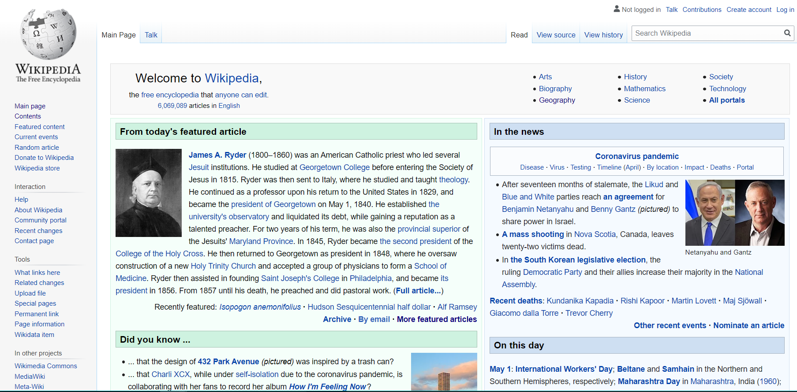
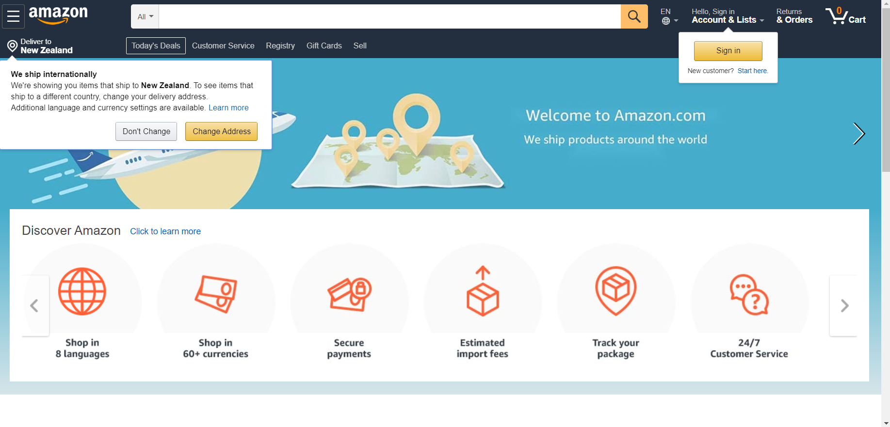

# Activity 4.1-4.2

4.1 Record in your course GitBook in your own words at least 4 challenges you see for incorporating experience design when building a system.

1. misconception about what you do

one of the most common challenges UX designers face is a lack of understanding about what they do. If it’s unclear as to what they do and why it’s important, it can be difficult to engage the right people. so , As a UX designer, it’s important to set expectations very early on. Start each new project with a stakeholder kick-off, explaining what you’ll be doing and why.

    2.  Conducting research under time and budget constraints

 At least once in UX career, designers will find yourself short on time and money for conducting user research. some clients or managers might even ask you to skip the research phase altogether. but the user research is important part of designing. When faced with time and budget constraints, it’s important to remember that some research is better than none

   3.  Deciding which problem to solve

The more insights they uncover, the more problems they will identify and the harder it becomes to settle on just one. It’s inevitable that designers will uncover new pain-points along the way, but they can’t change tack every time this occurs.

   4. Bridging the gap between design and development

Designers and developers have very different yet equally important roles to play in the product development process. While designers are thinking about the user and the journey they will take through the product, the developers are concerned with what’s technically feasible. The best way to avoid discord between design and development is to communicate early and often.

4.2

usability is concerned with the effectiveness, efficiency, and satisfaction with which specified users achieve specifiied goals in particular environments. and its aim is to make that web site easy to use. 

On the other hand, user experience is concerned with all aspects of the user’s experience when interacting with the product, service, environment or facility. and its aim is to make the user happy before, during and after using that web site.

in my opinion, Wikipedia is one of the websites with poor usability. 

there are so many words on the first page and it makes users feel tired and bored. I think it needs more structured and using icon or images to indicate their articles. 

On the other hand, Amazon website has good usability. it is easy for users to understand what the icons present and access to what they want to. 

