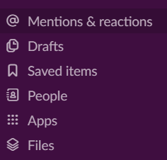
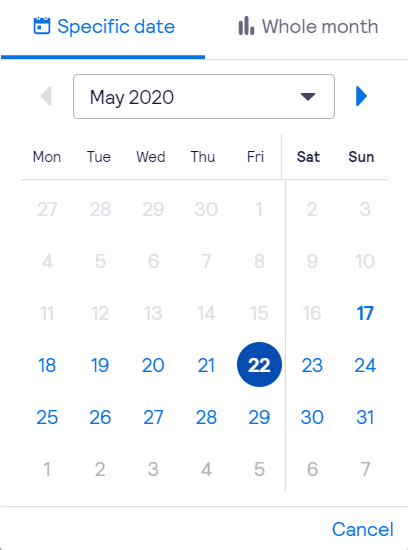

# Activity 5.1-5.2

#### Activity 5.1

**UI basic principles**

there are four kinds of interface elements: 

1. input controls
2. navigational components
3. informational components
4. containers

-input controls

Check boxes: check boxes usually present in a vertical list and allow the user to select options from a set. 

Radio buttons: it allows the users to choose only one between two options.

 Dropdown lists: dropdown lists are similar with radio buttons that allow only one thing to choose but are more compact. so you can save space. 

List boxes: list boxes allow the users to select a multiple items at a time.

Buttons: buttons indicate an action upon touch and they are usually presented by text, icon or both

Dropdown button: when you clicked your mouse upon icon or text, you can choose several items.

Toggles: a toggle button allows the user to change a setting between two states. they are most effective when the on/off states are visually distinct.

Date and time pickers: a date and time pickers allow the user to select a date and time. 

-Navigational Components

Search Field: a search box allows users to enter a keyword and phrase that they want to search. after submitting the words, they can get relevant results. 

Breadcrumb: breadcrumbs allow users to identify their current location within the system by providing a clickable trail. 

Pagination: pagination divides content up between pages and allow users to skip between pages. 

Tags: tags allow users to find content in the same category. 

Sliders: a slider \(a.k.a track bar\) allows users to set or adjust a value which they are familiar with.

Icons: Icons indicate items by using drawings and help users to navigate the system. typically, icons are hyperlinked.

Image Carousel: Image Carousel allow users to browse through a set of items and make a selection of one if they so choose. 

-Information Components

Notifications: a notification is an update message that announces something new for the users to see. 

Progress Bars: a progress bar indicates where a user is as they advance through a series of steps in a process. the bars are usually not clickable. 

Tool Tips: a tool tip allows a user to see hints when they hover over an item 

Message Boxes: a message box is a small window that provides information to users requires them to take an action before they can move forward.

Modal Window\(Pop-up\): a modal window requires users to interact with it in some way before they can return to the website.

-Containers

Accordion: when a label is clicked, it expands the section showing the content within. there can have one or more items.

this image presents that by using different type of fonts, colours and sizes, users can feel the hierarchy structure. 

#### Activity 5.2 

1. smart devices
2. mobile applications
3. screen and buttons on a parking meter
4. website

each one has a different screen size and type of users and their uses are different as well. For example, a mobile application is based on a small screen \(such as smart phone or tablet etc..\) compared to a website, and recently almost people have used smart phone instead of a cell phone. So, the importance of mobile applications have risen rapidly. they need to make touchable. 

on the other hand, users usually access a website using their mobile phone so it is totally different from a size of mobile applications. therefore, this fact makes user interface design different between  each medium. 

