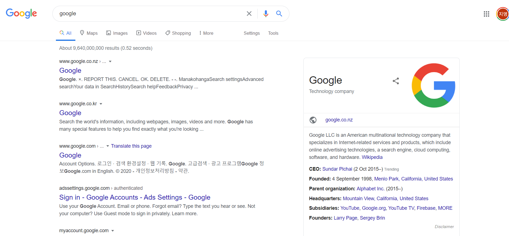

# Activity6.1

#### Activity 6.1

**What makes a good web experience?**

The best web experience I think is that when you access a website, you can easily find out what the site exists for and what the purpose is. for making a good web experience, the one of the most important points is whether users can easily access the information they want. 

The best site I've ever experienced is YouTube. you can find that this is a video site in logo, and user-centered videos. easy search functions are also good as well.

#### Activity 6.2

**Design that enhances content**

I think Google is the most representative example of a standard design. Everyone knows how to use the site and functions even some people who have never used this kind of websites. 

#### 

